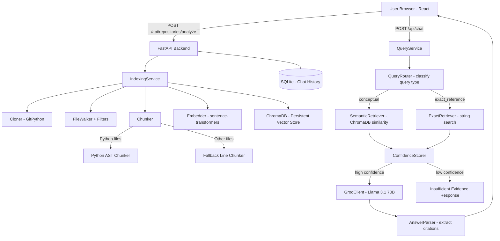

# CodeMind — AI Codebase Chat Portal

> Chat with any GitHub repository using AI — grounded in real code, with exact file and line citations.

---

## What Is CodeMind?

CodeMind lets you paste a public GitHub repository URL and then have a natural conversation about the codebase. Unlike general-purpose AI, CodeMind:

- **Only answers from actual repository code** — never invents information
- **Cites exact files and line numbers** — every claim is traceable
- **Honestly says "I don't know"** when evidence is insufficient
- **Uses smart routing** — exact search for "where is X used?" and semantic search for "how does X work?"

---

## Features

| Feature | Details |
|---------|---------|
| 🔍 Repository Ingestion | Clones via Git, filters source files, ignores build artifacts |
| 🧩 AST-Aware Chunking | Uses Python's `ast` module to split at function/class boundaries |
| 🧮 Semantic Embeddings | `all-MiniLM-L6-v2` runs locally — no embedding API needed |
| 🗄️ Vector Search | ChromaDB for persistent, fast similarity search |
| 🔀 Query Routing | Classifies queries as conceptual vs exact-reference |
| 📍 Exact Search | Regex/string search for "where is X called?" queries |
| 🤖 Groq + Llama | Fast inference with Llama 3.1 70B for answer generation |
| 💬 Chat History | SQLite-backed conversations with full message history |
| 📎 Citations | Clickable file:line-range badges that open a code viewer |
| 🛡️ Honesty Layer | Confidence scoring prevents LLM hallucination |

---

## Architecture



---

## Tech Stack

| Layer | Technology | Why |
|-------|-----------|-----|
| Frontend | React 18 + Vite | Fast, component-based UI |
| Styling | Vanilla CSS | Full control, no framework overhead |
| Backend | Python + FastAPI | Fast async API, auto-documentation |
| LLM | Groq + Llama 3.1 70B | Free tier, ~800 tok/s inference |
| Embeddings | sentence-transformers | Runs locally, no API key needed |
| Vector DB | ChromaDB | Persistent, easy to use locally |
| Database | SQLite + SQLModel | Simple, no server needed |
| Git | GitPython | Repository cloning |

---

## Setup Instructions

### Prerequisites
- Python 3.11+
- Node.js 18+
- Git installed on your system
- A free [Groq API key](https://console.groq.com)

### 1. Clone / Navigate to the project

```bash
cd CodeMind
```

### 2. Setup environment variables

```bash
# Copy the example file
cp .env.example backend/.env

# Edit backend/.env and add your Groq API key
GROQ_API_KEY=your_groq_api_key_here
```

### 3. Setup the backend

```bash
cd backend

# Create virtual environment
python -m venv venv

# Activate virtual environment
# On Windows:
venv\Scripts\activate
# On Mac/Linux:
source venv/bin/activate

# Install dependencies
pip install -r requirements.txt
```

### 4. Setup the frontend

```bash
cd frontend
npm install
```

---

## Running the Application

### Start the backend

```bash
cd backend
# Make sure your venv is activated!
uvicorn main:app --reload --port 8000
```

The API will be available at:
- `http://localhost:8000` — API root
- `http://localhost:8000/docs` — Interactive API documentation (Swagger UI)

### Start the frontend

```bash
cd frontend
npm run dev
```

The app will open at `http://localhost:5173`

---

## Environment Variables

| Variable | Default | Description |
|----------|---------|-------------|
| `GROQ_API_KEY` | *(required)* | Your Groq API key from console.groq.com |
| `GROQ_MODEL` | `llama-3.1-70b-versatile` | Which Groq model to use |
| `EMBEDDING_MODEL` | `all-MiniLM-L6-v2` | sentence-transformers model (runs locally) |
| `REPOS_DIR` | `../data/repos` | Where cloned repos are stored |
| `CHROMA_DIR` | `../data/chroma` | Where ChromaDB data is stored |
| `DATABASE_URL` | `sqlite:///./codemind.db` | SQLite database location |
| `TOP_K` | `8` | Number of chunks to retrieve per query |
| `CONFIDENCE_THRESHOLD` | `0.35` | Minimum confidence to generate an answer |
| `MAX_REPO_SIZE_MB` | `500` | Max repository size to clone |
| `MAX_FILE_SIZE_MB` | `2` | Max individual file size to parse |

---

## How Repository Ingestion Works

1. **Validate URL** — Must match `https://github.com/owner/repo` pattern
2. **Clone** — Shallow clone (`--depth=1`) for speed using GitPython
3. **Walk files** — `os.walk()` through the directory tree
4. **Filter** — Skip: `.git`, `node_modules`, `venv`, binaries, large files
5. **Chunk** — Split source files into overlapping code pieces
6. **Embed** — Convert each chunk to a 384-dimensional vector
7. **Store** — Upsert into ChromaDB with full metadata

The repository only needs to be indexed once. Re-submitting the same URL returns the cached index.

---

## How AST Chunking Works

For Python files, we use Python's built-in `ast` module:

```python
tree = ast.parse(source_code)
for node in ast.iter_child_nodes(tree):
    if isinstance(node, ast.FunctionDef):
        # Extract function with exact line numbers
        chunk = CodeChunk(start_line=node.lineno, end_line=node.end_lineno, ...)
```

This produces chunks like:
- `src/auth.py:42-67` → `def authenticate(user, password):`
- `src/models.py:10-45` → `class User:`

For non-Python files, we use a sliding-window line chunker (60 lines, 15-line overlap) to ensure no code is missed.

---

## How Retrieval Routing Works

The `QueryRouter` classifies each question:

| Pattern | Classification |
|---------|---------------|
| "where is X used?" | `EXACT_REFERENCE` |
| "find all references to Y" | `EXACT_REFERENCE` |
| "which files import Z?" | `EXACT_REFERENCE` |
| "how does authentication work?" | `CONCEPTUAL` |
| "explain the database schema" | `CONCEPTUAL` |

**CONCEPTUAL** → ChromaDB semantic similarity search  
**EXACT_REFERENCE** → File system string/regex search + semantic refinement

---

## How Confidence Scoring Works

Before generating an answer, we compute a confidence score:

```
score = (top_similarity × 0.6)
      + (relevant_chunk_count / 5 × 0.3)
      + (exact_match_bonus × 0.1)
```

If `score < CONFIDENCE_THRESHOLD (0.35)`, the LLM is **not called**. Instead we return:
> "I couldn't find enough relevant evidence in this repository to answer that confidently."

---

## Running Tests

```bash
cd backend
# Activate venv first!
pytest tests/ -v
```

Tests cover:
- URL validation
- File filtering
- Python AST chunking
- Query classification
- Confidence scoring

---

## Example Questions to Try

After indexing `https://github.com/tiangolo/fastapi`:

**Conceptual:**
- "How does dependency injection work in FastAPI?"
- "Explain the routing system."
- "How are validation errors handled?"

**Exact Reference:**
- "Where is the Depends class used?"
- "Which files import APIRouter?"
- "Where is the OpenAPI schema generated?"

**Honesty test:**
- "What is the weather today?"  
  → Expected: "I couldn't find enough relevant evidence..."

---

## Known Limitations

- Only public GitHub repositories (no authentication)
- Very large repos (>500MB) are rejected
- Python AST chunking is best-in-class; other languages use line chunking
- Groq API has rate limits on the free tier
- First indexing run downloads the embedding model (~90MB one-time)

---

## Future Improvements

- [ ] tree-sitter for AST-aware chunking of JS/TS/Go/Java
- [ ] Streaming LLM responses
- [ ] User authentication
- [ ] Private repository support (via GitHub token)
- [ ] Improved query routing with LLM classification
- [ ] Re-index on repository updates
- [ ] Export chat as markdown
- [ ] Multi-repository search

---

## Project Structure

```
CodeMind/
├── backend/
│   ├── main.py              ← FastAPI app entrypoint
│   ├── config.py            ← Environment configuration
│   ├── database.py          ← SQLite setup
│   ├── api/                 ← HTTP route handlers
│   │   ├── repositories.py
│   │   ├── chat.py
│   │   └── search.py
│   ├── ingestion/           ← Repository cloning & file filtering
│   │   ├── cloner.py
│   │   ├── file_walker.py
│   │   └── filters.py
│   ├── chunking/            ← Code splitting
│   │   ├── chunker.py       ← Dispatcher
│   │   ├── python_ast_chunker.py
│   │   ├── fallback_chunker.py
│   │   └── chunk_models.py
│   ├── embeddings/          ← Vector embeddings
│   │   ├── embedder.py
│   │   └── chroma_store.py
│   ├── retrieval/           ← Search
│   │   ├── retriever.py
│   │   ├── semantic_retriever.py
│   │   └── exact_retriever.py
│   ├── routing/             ← Query classification
│   │   └── query_router.py
│   ├── generation/          ← LLM answer generation
│   │   ├── groq_client.py
│   │   ├── prompt_builder.py
│   │   └── answer_parser.py
│   ├── confidence/          ← Honesty layer
│   │   └── scorer.py
│   ├── services/            ← Business logic orchestrators
│   │   ├── indexing_service.py
│   │   ├── query_service.py
│   │   └── chat_service.py
│   ├── models/              ← Database + API schemas
│   │   ├── repository.py
│   │   ├── chat.py
│   │   └── schemas.py
│   └── tests/               ← Unit tests
│
├── frontend/
│   └── src/
│       ├── App.jsx
│       ├── globals.css
│       ├── api/             ← Backend API calls
│       ├── store/           ← Zustand global state
│       └── components/
│           ├── layout/      ← Sidebar
│           ├── repo/        ← Setup screen + progress
│           ├── chat/        ← Chat window, messages, input
│           ├── citations/   ← Citation badges + code viewer
│           └── ui/          ← Shared components
│
├── data/
│   ├── repos/               ← Cloned repositories (auto-created)
│   └── chroma/              ← ChromaDB vector store (auto-created)
│
├── .env.example
└── README.md
```
